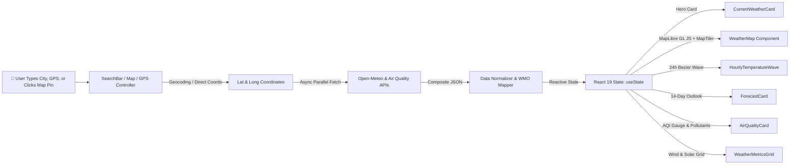
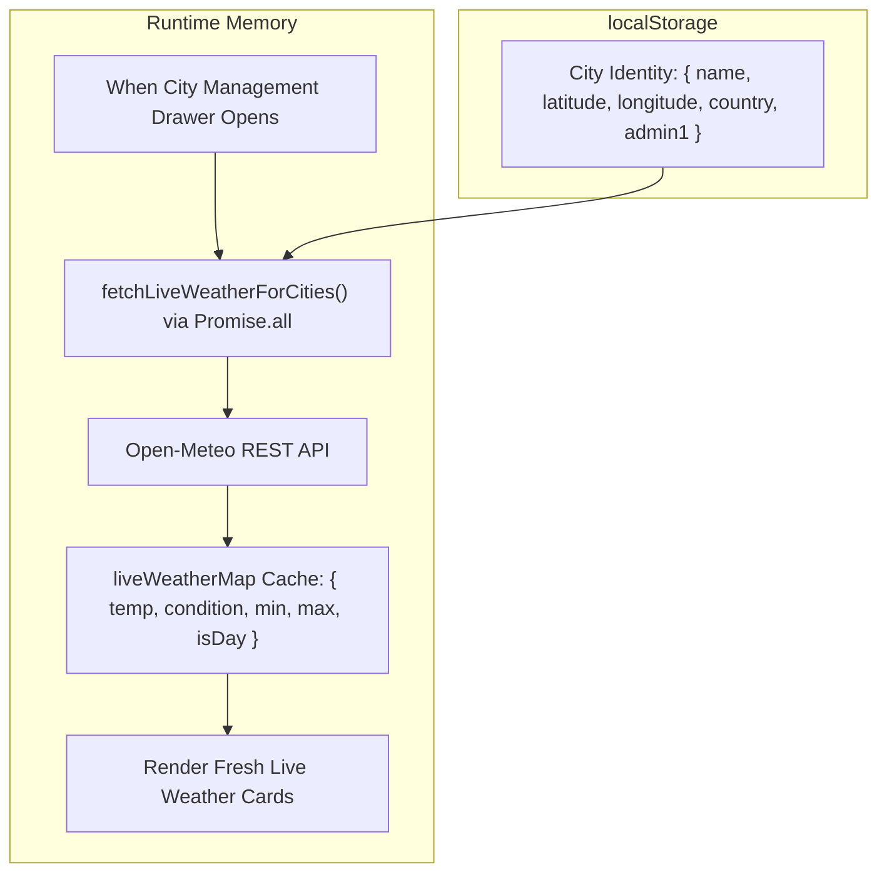

# ⛅ WeatherHub — Live Weather & Air Quality Intelligence

> **Project 2 — Full-Stack Preparation Series**  
> A high-performance, responsive, production-ready Weather & Air Quality Hub built with **React 19**, **Tailwind CSS**, and modern **RESTful API integration**.

[](https://react.dev/)
[](https://tailwindcss.com/)
[](https://vite.dev/)

---

## 📸 Highlights & Modern Feature Set

WeatherHub delivers real-time meteorological intelligence, air quality analysis, and extended multi-day trajectories with a clean, decoupled architecture:

* **⚡ Real-Time Weather Engine**: Fetches current temperature, feels-like temperature, precipitation, humidity, pressure, wind direction with compass orientation, and day/night status.
* **🗺️ Interactive MapLibre GL Weather Map**: High-performance vector map engine powered by **MapLibre GL JS** and **MapTiler** vector tiles:
  * **Weather-Aware City Markers**: Custom dynamic bubble displaying live temperature, weather condition emojis (☀️, ⛅, 🌧️, ⛈️), city name, feels-like temperature, and pulsing radar ring.
  * **Click-to-Sync Favorite Markers**: Saved favorite cities appear on the map with gold badges; clicking any favorite marker switches the dashboard and flies the map camera directly to that city without page reloads.
  * **Multi-Style Switcher**: Toggle between **Dark Matter**, **Streets**, **Satellite Hybrid**, and open-source **OpenStreetMap** layers.
  * **Map Controls & Fullscreen**: Integrated zoom buttons, center on selected city, live GPS locate, and responsive expandable/fullscreen modes.
* **🎯 Live GPS Geolocation**: 1-click real-time device GPS location lookup with client-side reverse geocoding via BigDataCloud to identify exact localities.
* **📑 Favorite Cities & City Management**:
  * **Separation of Concerns**: Persistent `localStorage` strictly stores city geographic identities (`{ name, latitude, longitude, country, admin1 }`).
  * **On-Demand Live Meteorological Sync**: Fresh live weather for all favorite cities is fetched in parallel via `Promise.all()` upon opening, ensuring values are always 100% accurate.
  * **Zero Geocoding Latency**: Selecting any saved city immediately uses its coordinates, skipping geocoding for instant updates.
* **🌊 24-Hour Draggable Hourly Trajectory**:
  * Smooth **cubic bezier curve** connecting the next 24 consecutive hours of temperatures.
  * Interactive **mouse drag-to-scroll** (desktop) and **touch swipe** (mobile) with left/right stepping buttons.
  * Signature **active glowing pill indicator** with vertical dotted drop line and rain probability percentages.
* **📅 Up to 14-Day Extended Daily Outlook**: Full 14-day daily weather predictions (`forecast_days=14`) with a smooth vertical scrollable list, condition badges, and compact/expanded view toggles.
* **🌬️ Comprehensive Air Quality Index (AQI)**: US EPA & European standards with color-coded safety badges, health advisories, and granular breakdown of pollutants:
  * **PM2.5** (Fine inhalable particles)
  * **PM10** (Coarse particulate matter)
  * **NO₂** (Nitrogen Dioxide)
  * **O₃** (Ground-level Ozone)
  * **CO** (Carbon Monoxide)
* **💎 Radiant Floating Navbar**: Floating pill layout styled with a multi-color glowing gradient border line (`cyan → blue → purple`), metallic typography, digital seconds clock, and instant unit switcher (°C / °F).
* **🎨 High-Definition Atmospheric Backdrops**: Dynamic cinematic skies for **Day**, **Golden Hour Sunset**, **Moonlit Midnight Clouds**, and **Overcast Storms**.

---

## 🏗️ Architecture & Decoupled Data Flow

### 1. Main Dashboard Pipeline


### 2. Favorite Cities Architecture (Separation of Concerns)


---

## 📂 Project Structure

```
weather-hub/
├── public/
│   ├── backgrounds/
│   │   ├── day.jpg                  # High-definition sunny sky texture
│   │   ├── sunset.jpg               # Golden hour twilight texture
│   │   ├── night.jpg                # Moonlit midnight cloudscape texture
│   │   └── storm.jpg                # Dramatic storm & rain overcast texture
│   └── favicon.svg
├── src/
│   ├── components/
│   │   ├── Navbar.jsx               # Floating header with glowing border line & GPS
│   │   ├── SearchBar.jsx            # City search input with live location chip
│   │   ├── CurrentWeatherCard.jsx   # Hero card with massive temp & condition
│   │   ├── WeatherMap.jsx           # Interactive MapLibre GL JS + MapTiler map
│   │   ├── HourlyTemperatureWave.jsx# 24-hour cubic bezier draggable wave chart
│   │   ├── ForecastCard.jsx         # 14-day extended daily forecast scroll list
│   │   ├── AirQualityCard.jsx       # US EPA AQI gauge, progress meter & pollutants
│   │   ├── WeatherMetricsGrid.jsx   # Wind compass, UV index, pressure, sunrise/sunset
│   │   ├── CityManagementModal.jsx  # Persistent favorite cities manager
│   │   ├── LoadingSkeleton.jsx      # Shimmer placeholder UI
│   │   └── ErrorAlert.jsx           # Resilient error notification with retry buttons
│   ├── services/
│   │   └── weatherService.js        # Data Access Layer (REST APIs, geocoding, batch sync)
│   ├── utils/
│   │   └── weatherUtils.jsx         # Temperature converters, Lucide icons, gradients
│   ├── App.jsx                      # Root orchestrator managing state & GPS
│   ├── main.jsx                     # React 19 application entry point
│   └── index.css                    # Tailwind CSS directives & custom keyframes
├── .env.example                     # Environment template for optional API keys
├── .gitignore                       # Clean Git ignore rules (build, logs, env, OS)
├── package.json                     # Dependencies and scripts
└── vite.config.js                   # Vite configuration with Tailwind CSS
```

---

## 🎓 Core Concepts

### 1. Separation of Concerns (Persistent Identity vs. Volatile State)
* **Problem**: Storing static meteorological values (`temp: 31`, `condition: "Cloudy"`) in `localStorage` causes data staleness.
* **Architecture**: We decouple the model: `localStorage` stores only immutable geographic identities (`name`, `latitude`, `longitude`). On application mount, asynchronous batch queries (`Promise.all()`) populate transient in-memory state with live values.

### 2. React Virtual DOM & Reconciliation
* **Concept**: Direct DOM mutations cause costly layout recalculation and browser repaints.
* **React Solution**: React maintains a virtual representation of the DOM tree in memory. When state updates via `useState`, React executes its heuristic $O(n)$ diffing algorithm, identifies exact node diffs, and batches real DOM updates (**Reconciliation**).

### 3. `useState` vs `useEffect`
* **`useState`**: Declares local reactive state variables. Updating state through its setter invokes component re-rendering.
* **`useEffect`**: Synchronizes components with side effects (fetching REST APIs, subscribing to geolocation, setting intervals). An empty dependency array `[]` ensures execution only on component mount.

### 4. Promises & `async / await`
* **Promises**: Objects representing pending, fulfilled, or rejected asynchronous operations.
* **`async / await`**: Syntactic sugar over Promises enabling sequential, linear code structure while keeping the JavaScript single-threaded event loop non-blocking.

### 5. HTTP `GET` vs `POST`
* **`GET`**: Safe, idempotent method for data retrieval. Parameters travel in the URL query string; ideal for cached meteorological readings.
* **`POST`**: Non-idempotent method for transmitting payload bodies to create or mutate server resources.

---

## 🚀 Getting Started

### Prerequisites
* **Node.js**: v18.0.0 or higher (v22+ recommended)
* **npm**: v9.0.0 or higher

### Installation & Run

1. **Clone the repository:**
   ```bash
   git clone https://github.com/adityasen23453-droid/WeatherHub.git
   cd WeatherHub
   ```

2. **Install dependencies:**
   ```bash
   npm install
   ```

3. **Configure environment (Optional for MapTiler styles):**
   ```bash
   cp .env.example .env
   ```
   Add your free MapTiler API key from [cloud.maptiler.com](https://cloud.maptiler.com/):
   ```env
   VITE_MAPTILER_API_KEY=your_key_here
   ```
   *(Note: The map also includes a 1-click fallback to public OpenStreetMap tiles if no key is configured).*

4. **Start local development server:**
   ```bash
   npm run dev
   ```
   Open [http://localhost:5173](http://localhost:5173) in your browser.

5. **Build for production:**
   ```bash
   npm run build
   ```


