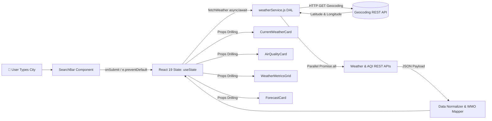

# ⛅ WeatherHub — Live Weather & Air Quality Intelligence

> **Project 2  Full-Stack Preparation Series**  
> A high-performance, responsive, production-ready Weather & Air Quality Hub built with **React 19**, **Tailwind CSS**, and modern **RESTful API integration**.

[](https://react.dev/)
[](https://tailwindcss.com/)
[](https://vite.dev/)
[](https://github.com/adityasen23453-droid/WeatherHub)

---

## 📸 Overview & Key Features

WeatherHub delivers instant meteorological and atmospheric intelligence for any city worldwide with zero configuration hurdles.

* **⚡ Real-Time Weather Engine**: Fetches live temperature, feels-like metrics, precipitation, weather conditions, and day/night status.
* **🌬️ Comprehensive Air Quality Index (AQI)**: Implements US EPA and European standards, color-coded risk meter, health advisories, and granular breakdown of pollutants:
  * **PM2.5** (Fine inhalable particles)
  * **PM10** (Coarse particulate matter)
  * **NO₂** (Nitrogen Dioxide)
  * **O₃** (Ground-level Ozone)
  * **CO** (Carbon Monoxide)
* **📅 5-Day Extended Forecast**: Daily high/low temperature ranges, weather descriptions, and dynamic icon rendering.
* **🧭 Detailed Atmospheric Metrics**: Wind speed, compass direction angle, UV Index rating, atmospheric pressure, and sunrise/sunset schedule.
* **🔄 Zero-Latency Unit Conversion**: Seamlessly toggle between Celsius (°C) and Fahrenheit (°F) across all metrics without re-fetching.
* **✨ Shimmer Loading Skeleton**: Eliminates layout shift (CLS) with fluid skeleton placeholders during asynchronous network fetches.
* **🛡️ Bulletproof Error Handling**: Gracefully catches 404 (City Not Found), offline network errors, and provides one-click recovery chips.
* **🎨 Glassmorphic Responsive Design**: Mobile-first UI styled with Tailwind CSS, custom glass backdrop filters, and dynamic weather gradients.

---

## 🏗️ Architecture & Data Flow



---

## 📂 Project Structure

```
weather-hub/
├── public/
│   └── favicon.svg
├── src/
│   ├── components/
│   │   ├── Navbar.jsx               # Header, live clock, °C/°F toggle, GitHub link
│   │   ├── SearchBar.jsx            # Controlled input, clear button, quick city chips
│   │   ├── CurrentWeatherCard.jsx   # Hero card with temperature, condition, min/max
│   │   ├── AirQualityCard.jsx       # US EPA AQI gauge, pollutant breakdown, health advice
│   │   ├── WeatherMetricsGrid.jsx   # Wind, UV index, pressure, sunrise & sunset
│   │   ├── ForecastCard.jsx         # 5-day daily forecast strip
│   │   ├── LoadingSkeleton.jsx      # Shimmer placeholder UI
│   │   └── ErrorAlert.jsx           # Resilient error notification with retry buttons
│   ├── services/
│   │   └── weatherService.js        # Data Access Layer (async/await, fetch, geocoding)
│   ├── utils/
│   │   └── weatherUtils.jsx         # Unit converters, Lucide icon mappers, gradients
│   ├── App.jsx                      # Root orchestrator managing useState & useEffect
│   ├── main.jsx                     # React 19 application root
│   └── index.css                    # Tailwind CSS directives & glassmorphic classes
├── .env.example                     # Environment template for optional API keys
├── .gitignore                       # Clean Git ignore rules
├── package.json                     # Dependencies and scripts
└── vite.config.js                   # Vite configuration with @tailwindcss/vite
```

---

## 🎓 Core TCS Interview Concepts Mastered

### 1. React Virtual DOM & Reconciliation
* **Concept**: Real DOM operations are computationally expensive because re-rendering triggers browser layout recalculation and repaint.
* **React Solution**: React maintains a lightweight JavaScript object tree representation in memory called the **Virtual DOM**. When state changes, React creates a new VDOM snapshot, computes the minimal difference using its **Diffing Algorithm (Heuristic O(n))**, and performs batch updates to the real DOM (Reconciliation).

### 2. `useState` vs `useEffect`
* **`useState`**: Hook used to store and trigger updates for reactive values inside a component. When state updates via its setter function (`setWeatherData`), React triggers a re-render.
* **`useEffect`**: Hook used to synchronize a component with external side-effects (e.g., REST API calls, timer intervals, direct DOM mutations). An empty dependency array `[]` ensures the effect runs only once when the component mounts.

### 3. Promises and `async / await`
* **Promises**: Objects representing the eventual completion (resolve) or failure (reject) of an asynchronous operation.
* **`async / await`**: Syntactic sugar built on top of ES6 Promises that enables developers to write asynchronous code that reads sequentially like synchronous code, while keeping the JavaScript single-threaded event loop unblocked.

### 4. HTTP `GET` vs HTTP `POST`
* **`GET`**: Idempotent and safe method used to retrieve data from a server without modifying server state. Parameters are appended directly to the URL query string.
* **`POST`**: Non-idempotent method used to send data to a server to create or update resources. Data is encapsulated inside the HTTP request body, making it suitable for secure and larger payloads.

---

## 🚀 Getting Started

### Prerequisites
* **Node.js**: v18.0.0 or higher (v22+ recommended)
* **npm**: v9.0.0 or higher

### Installation

1. **Clone the repository:**
   ```bash
   git clone https://github.com/adityasen23453-droid/WeatherHub.git
   cd WeatherHub
   ```

2. **Install dependencies:**
   ```bash
   npm install
   ```

3. **Start the local development server:**
   ```bash
   npm run dev
   ```
   Open [http://localhost:5173](http://localhost:5173) in your browser.

4. **Build for production:**
   ```bash
   npm run build
   ```

---

## 👨‍💻 Author

* **Developer**: [Aditya Sen](https://github.com/adityasen23453-droid)
* **Project**: TCS Technical Interview Master Blueprint — Project 2
